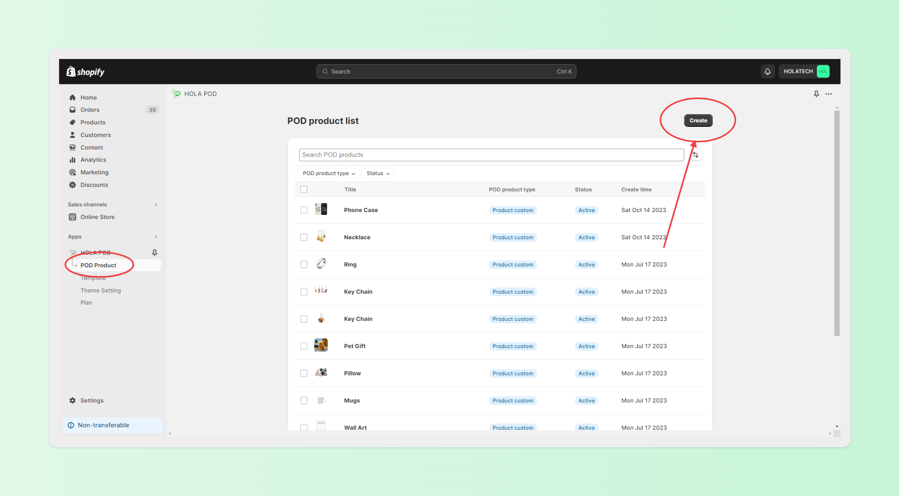
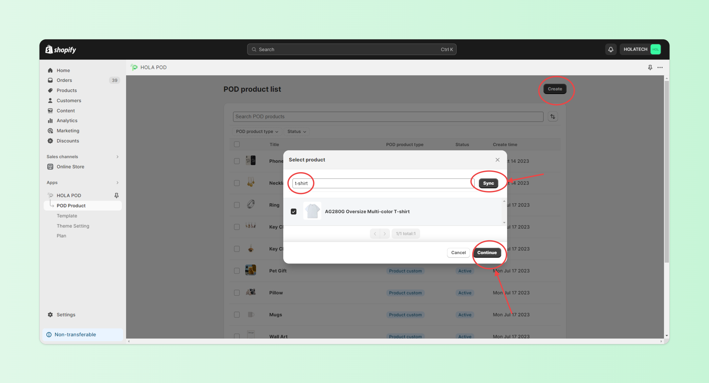

# 1 Product Template Setting

## Step 1 - Start journalling

Donec sed odio dui. Curabitur blandit tempus porttitor. Vivamus sagittis lacus vel augue laoreet rutrum faucibus dolor auctor. Donec ullamcorper nulla non metus auctor fringilla. Maecenas sed diam eget risus varius blandit sit amet non magna. Aenean lacinia bibendum nulla sed consectetur.

<figure><figcaption></figcaption></figure>

<figure><figcaption></figcaption></figure>

##

##

##

## Step 2 - Create Post

Praesent commodo cursus magna, vel scelerisque nisl consectetur et. Maecenas faucibus mollis interdum. Cras mattis consectetur purus sit amet fermentum. Fusce dapibus, tellus ac cursus commodo, tortor mauris condimentum nibh, ut fermentum massa justo sit amet risus. Donec ullamcorper nulla non metus auctor fringilla. Nullam quis risus eget urna mollis ornare vel eu leo. Aenean eu leo quam. Pellentesque ornare sem lacinia quam venenatis vestibulum.

