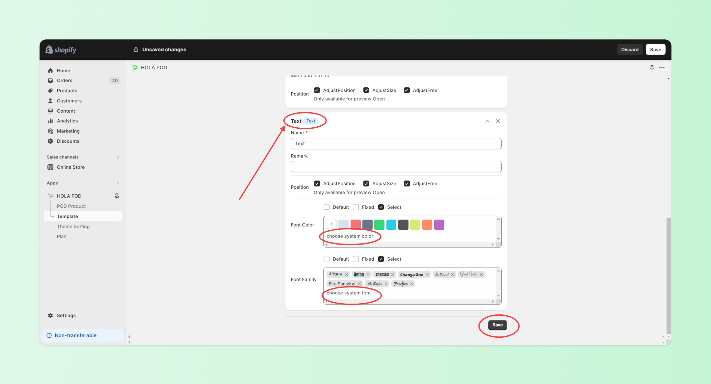

# 1 Product Template Setting

## Step 1 - Create a POD Template

Steps:

1. Click on 'HOLA POD App-Template.'
2. Click 'Create.'
3. Begin designing your custom template.

<figure><figcaption>
<mark style="color:red;background-color:yellow;">Click 'Create'.</mark>
</figcaption></figure>

 

<figure><figcaption>
<mark style="color:red;background-color:yellow;">Add text, images, and other content blocks as needed.</mark>
</figcaption></figure>

<figure><figcaption>
<mark style="color:red;background-color:yellow;">Customize colors, fonts, positions, etc. as needed.</mark>
</figcaption></figure>

 

<figure><figcaption></figcaption></figure>

<figure><figcaption>
<mark style="color:red;background-color:yellow;">Drag to reorder blocks as needed.</mark>
</figcaption></figure>

 

<figure><figcaption></figcaption></figure>

<figure><figcaption>
<mark style="color:red;background-color:yellow;">Preview template.</mark>
</figcaption></figure>

 

<figure><figcaption></figcaption></figure>

<figure><figcaption></figcaption></figure>

## Step 2 - Apply the Template to the Product

Steps:

1. Click 'HOLA POD App-POD Product.'
2. Click 'Create.'
3. Click 'Sync' online products.
4. Select the product.
5. Apply the template and usage type to the product.

<figure><figcaption></figcaption></figure>

 

<figure><figcaption>
<mark style="color:red;background-color:yellow;">Sync online products and select products.</mark>
</figcaption></figure>

<figure><figcaption>
<mark style="color:red;background-color:yellow;">Select the template and usage type as needed.</mark>
</figcaption></figure>

<figure><figcaption>
<mark style="color:red;background-color:yellow;">Make template adjustments as needed.</mark>
</figcaption></figure>

<figure><figcaption>
<mark style="color:red;background-color:yellow;">Preview.</mark>
</figcaption></figure>

<figure><figcaption>
<mark style="color:red;background-color:yellow;">Change the template usage type as needed. For example, apply the template only to a certain variant of the product.</mark>
</figcaption></figure>

<figure><figcaption>
<mark style="color:red;background-color:yellow;">Check the status.</mark>
</figcaption></figure>

<figure><figcaption>
<mark style="color:red;background-color:yellow;">POD product list: delete, activate, deactivate.</mark>
</figcaption></figure>

## Step 3 - Place Orders Online

Steps:

1. Choose the product variant.
2. Start designing the product.
3. Complete and confirm the design.
4. Add to cart and checkout.

<figure><figcaption></figcaption></figure>

<figure><figcaption>
<mark style="color:red;background-color:yellow;">Designing.</mark>
</figcaption></figure>

<figure><figcaption>
<mark style="color:red;background-color:yellow;">Preview.</mark>
</figcaption></figure>

<figure><figcaption>
<mark style="color:red;background-color:yellow;">Add to cart.</mark>
</figcaption></figure>

 

<figure><figcaption>
<mark style="color:red;background-color:yellow;">Check out.</mark>
</figcaption></figure>

<figure><figcaption>
<mark style="color:red;background-color:yellow;">Order checking. Click 'Link' to check product customization information.</mark>
</figcaption></figure>

<figure><figcaption></figcaption></figure>

 

<figure><figcaption></figcaption></figure>

 

<figure><figcaption></figcaption></figure>

