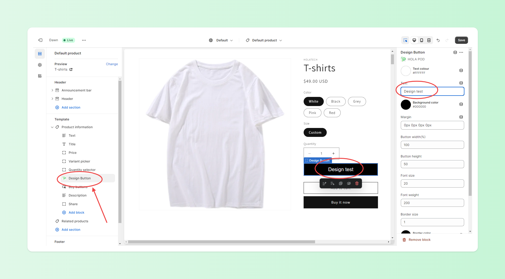
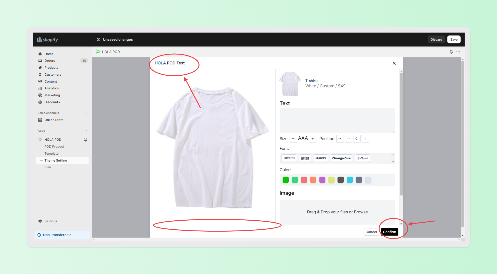

# 2 Theme Setting

## &#x20;✅- Product Page Button Customize

Freely customize button layout, including text, color, size, etc. to match your theme website settings.

Steps:

1. Click on 'Shopify-Themes-Customize.'
2. Search for a POD product page.
3. Click the 'HOLAPOD Design Button' to begin designing.

<figure><figcaption></figcaption></figure>

## ✅ - HOLA POD Theme Settings

Freely customize the POD product page layout, including text, colors, borders, etc., to match your theme website settings on any device.

Steps:

1. Click on 'HOLA POD App-Theme Settings.'
2. Customize the Header, Colors, and more.
3. Save your changes.

<figure><figcaption></figcaption></figure>

 

<figure><figcaption></figcaption></figure>

